## 1. 做了什么

在整理素材时，我找到了当前官网，并基于官网素材复刻了部分页面。由于原官网素材有一定局限，我在复刻基础上进一步调整了整体设计风格、交互体验和 SEO 配置。

原官网主要基于 Vue 实现。考虑到独立站对 SEO 的依赖更高，我用 Next.js 重写了一版 Demo，并复刻了官网中的视频播放、视差滚动等核心效果。Three.js 部分也做了初步复刻，但目前还没有充分打磨，因此暂时没有放到展示范围内。

Demo 地址：`https://fly.everyonehug.com/`

## 2. SEO 收录与搜索可见性

最开始检查时，我发现 Google 还没有明显收录当前官网及相关核心关键词，因此优先排查了 SEO 基础配置。

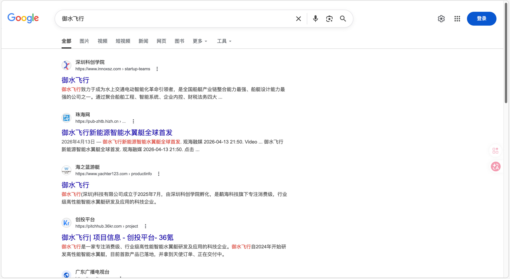

从当前网站结构看，官网更接近前端单页应用（SPA）。SPA 并不是不能做 SEO，但如果缺少服务端渲染 / 静态生成、sitemap、robots、canonical 和结构化数据等配套能力，搜索引擎对页面内容的理解和收录效率都会受到影响。

对于独立站来说，**SEO 是持续获客的基础设施**。御水飞行这类产品兼具科技、文旅和高客单属性，搜索流量可以承接品牌认知、项目合作、经销咨询和媒体关注等需求。

本次 Demo 主要做了这些 SEO 优化：

- **完善全站基础 SEO 配置**：补充 canonical、robots.txt 和 sitemap.xml。
- **配置 robots.txt 抓取规则**：允许搜索引擎抓取核心展示页面，同时屏蔽登录、订单、API、store/demo、help-center 等不适合收录的页面。
- **补齐核心页面 SEO 信息**：补充 title、description、keywords、canonical 和 robots meta。产品页如 `/models/h1`、`/models/h2` 设置为 `index, follow`。
- **避免重复或低价值页面影响整站质量**：对非核心页面设置 `noindex, follow`，减少无效页面被搜索引擎收录。
- **加入结构化数据**：补充 Organization、WebSite、WebPage、Product 等 JSON-LD，帮助搜索引擎理解品牌、产品和页面类型。
- **接入搜索引擎验证与主动推送能力**：加入 Bing IndexNow 和 Google Search Console 验证文件，方便后续观察收录情况。

Demo 刚发布后通常不会立刻出现在搜索结果中。一般情况下，搜索引擎完成发现、抓取、理解和收录需要数天到一周左右，具体还会受站点权重、外链、内容质量和抓取频率影响。

## 3. HTTPS 混合内容与证书安全

当前页面出现“不安全”提示，不一定是证书本身配置错误，更可能是 HTTPS 页面中加载了 HTTP 明文资源，形成了 **Mixed Content（混合内容）** 风险。

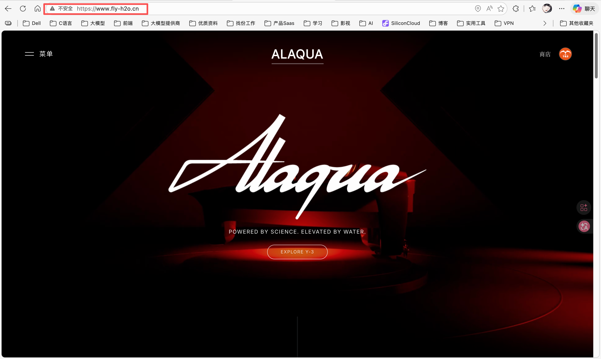

排查后发现，接口 `https://api.fly-h2o.cn/app-api/product/home-page/list` 返回了 HTTP 视频资源：

```text
data.0.spuVideoUrl = http://oss.fly-h2o.cn/20260323/video-12_1774280438606.mp4
data.1.spuVideoUrl = http://oss.fly-h2o.cn/20260324/Y-3hongse.0000_1774335126843.mp4
```

建议这样处理：

- **后端统一返回 HTTPS 资源地址**：将 `spuVideoUrl` 中的 `http://` 全部改为 `https://`。这两个资源的 HTTPS 地址我已验证可以正常访问。
- **前端增加兜底处理**：在渲染前对资源地址做安全处理，将 `http://` 强制替换为 `https://`，避免历史数据或异常数据继续触发安全提示。

对于高客单价、强品牌属性的独立站来说，**浏览器“不安全”提示会明显削弱用户信任**，建议优先修复。

## 4. OSS / static 资源访问控制

当前 OSS / static 资源看起来没有限制网页访问来源，存在一定安全和成本风险。第三方网站可以直接引用后端静态资源，每调用一次都会消耗资源流量。

以阿里云 OSS 为例，官方支持配置 Referer 白名单 / 黑名单，可以设置为 **只允许指定域名来源访问资源**。如果资源已经部署在公网环境，建议尽快补充访问来源限制。

建议策略：

- **为公开展示资源配置 Referer 白名单**：只允许官网域名、测试域名和必要 CDN 域名访问。
- **对不需要公网直连的资源增加权限控制**：避免内部素材、临时素材或高成本视频资源被直接外链。
- **保留必要的灰度和测试域名**：避免配置过严导致测试环境或预览环境无法加载素材。

从公网部署和品牌资产保护角度看，**资源访问控制应该尽早纳入上线检查项**。

## 5. Sentry 线上质量监控

本次 Demo 接入了 Sentry，用于提升线上问题定位效率和版本稳定性。

Sentry 可以自动捕获线上报错，定位具体出错位置，记录用户操作路径，并监控接口异常和慢请求。它也支持按版本追踪问题，例如每次发布新版本后，可以对比新旧版本的错误数量，判断本次上线是否引入新的线上问题。

当线上出现高频错误、严重异常或新版本新增问题时，还可以配置告警通知，方便第一时间处理。后续可以将 Sentry 作为前端线上质量监控入口，形成 **发现问题 → 定位问题 → 修复问题 → 验证版本** 的闭环。

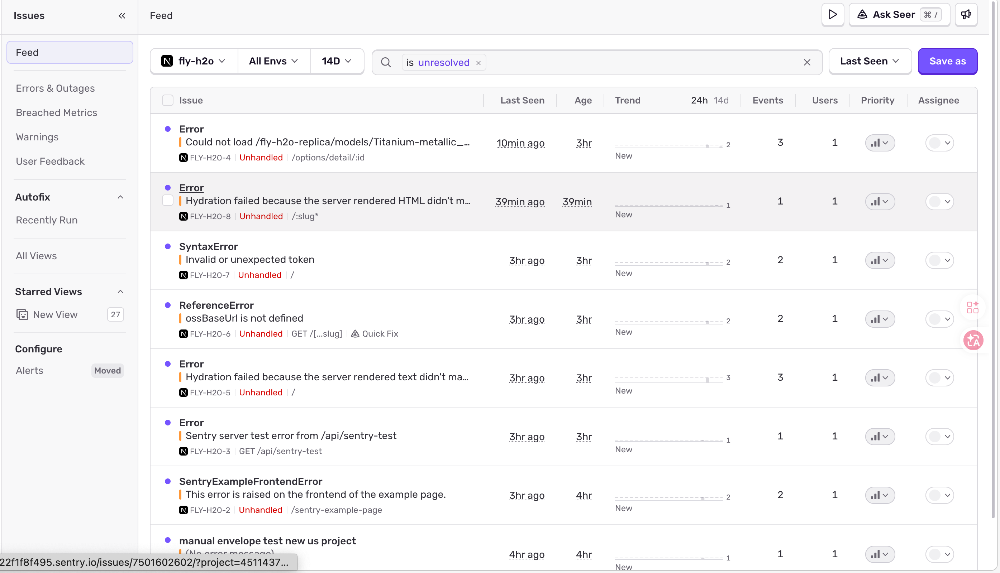

## 6. 页面交互与视觉规范问题

### 6.1 导航项点击语义不清晰

以导航页为例，右侧箭头通常意味着“可跳转”或“可展开”。但当前“水翼艇工艺”没有实际跳转链接，却仍然表现为可点击状态，容易造成用户误操作。


修改后，导航项的视觉状态和真实交互行为保持一致，减少用户误解。

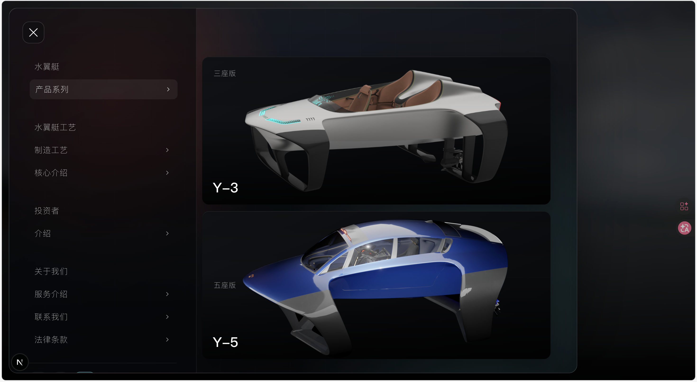

### 6.2 二级导航触发方式不符合常见预期

顶部导航通常会在 hover 状态下显示对应二级导航，而不是必须点击后才显示。当前交互需要点击才能切换二级导航，用户可能会误以为没有下拉内容。

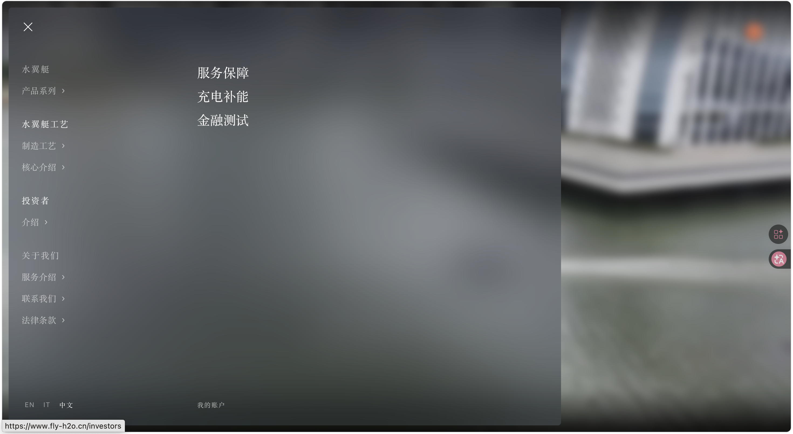

优化后，增加 hover 自动切换二级导航的能力，让导航反馈更符合用户习惯。

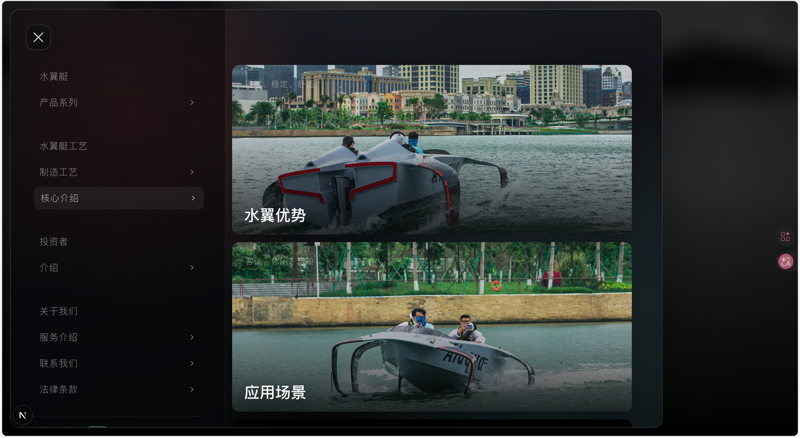

### 6.3 第三方或平台图标建议使用官方规范素材

部分图标与对应平台的官方图标规范不完全一致。对于品牌站来说，图标虽然是细节，但会影响整体专业度和可信度。

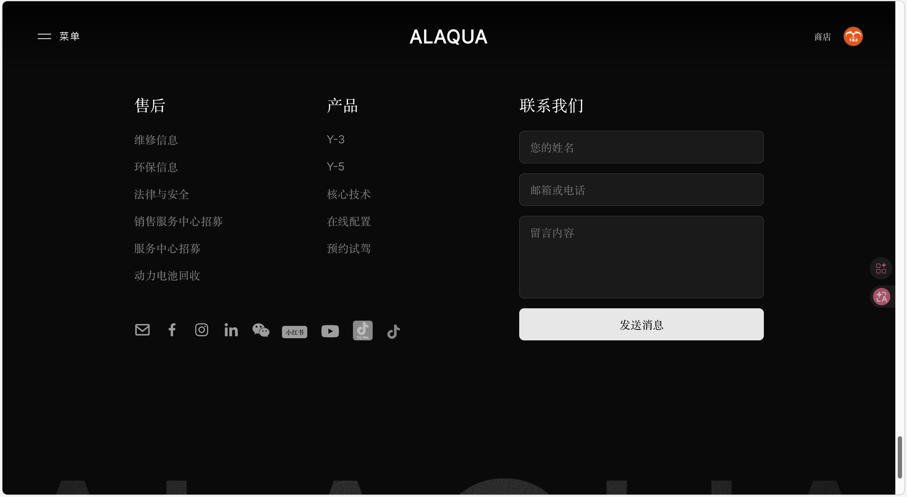

建议后续统一使用官方提供的 SVG / PNG 资源，并保持尺寸、圆角、留白和颜色规范一致。

### 6.4 页面主色调和组件风格需要统一

当前页面中存在主色调和组件风格不够统一的问题，不同模块之间的视觉语言略有割裂。

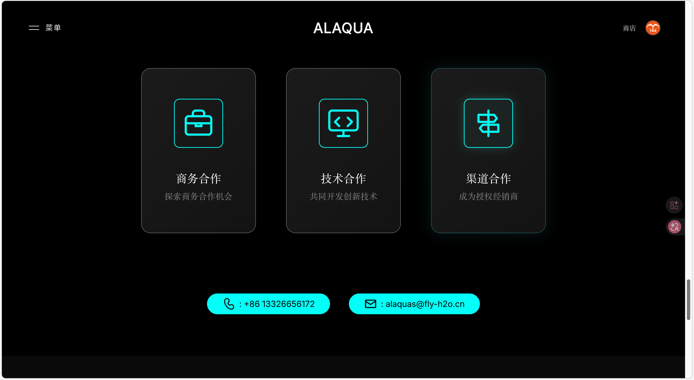

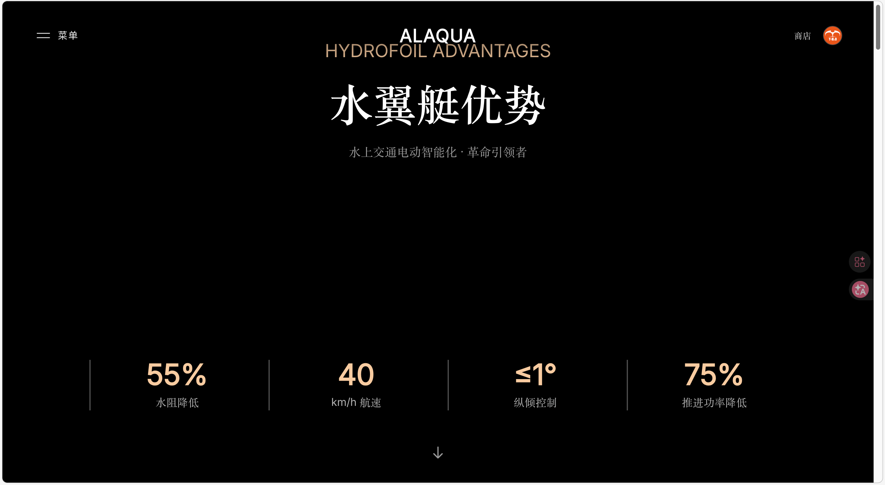

Demo 中先将整体色调统一为深色背景、白色主文案和可配置品牌强调色。后续建议基于品牌资产确定完整色板，包括主色、辅助色、强调色、背景色、边框色和状态色，避免不同页面各自发挥。

这里需要注意：红色在品牌中使用较多，但红色在界面中也可能带来“危险感”或“警示感”。如果要作为强调色，建议控制使用范围，避免整站大面积使用。

更合理的方式是 **在关键展示区域营造科技感，在阅读、表单、询盘和决策信息区域保证足够可读性**。

### 6.5 中英文字体风格需要统一

当前英文使用无衬线字体，而中文部分使用了较多衬线字体，不太符合整体的现代科技品牌调性。如果希望走现代、轻量、科技感路线，建议统一使用非衬线字体，例如苹方、思源黑体、阿里巴巴普惠体等。

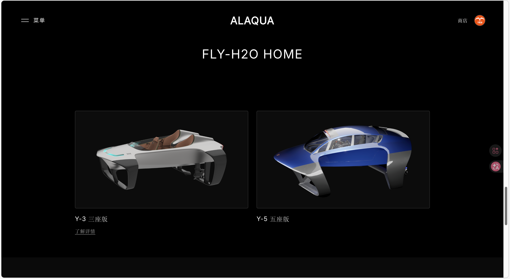

Demo 中统一了字体格式，确保中文和英文都使用更现代的非衬线字体，增强整体设计的一致性。

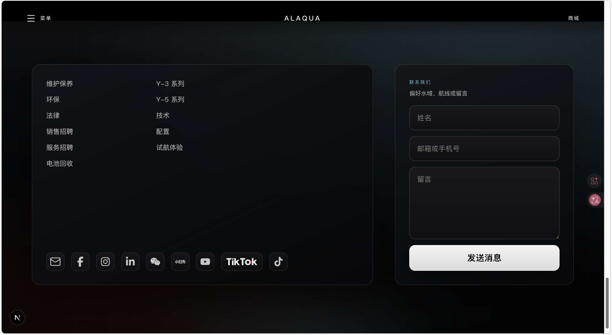

### 6.6 多语言内容存在混杂，i18n 需要完善

当前页面中存在不同语言混杂的情况，说明 i18n 没有完全覆盖所有文案。对于面向海外客户的独立站来说，多语言混杂会明显降低专业感。

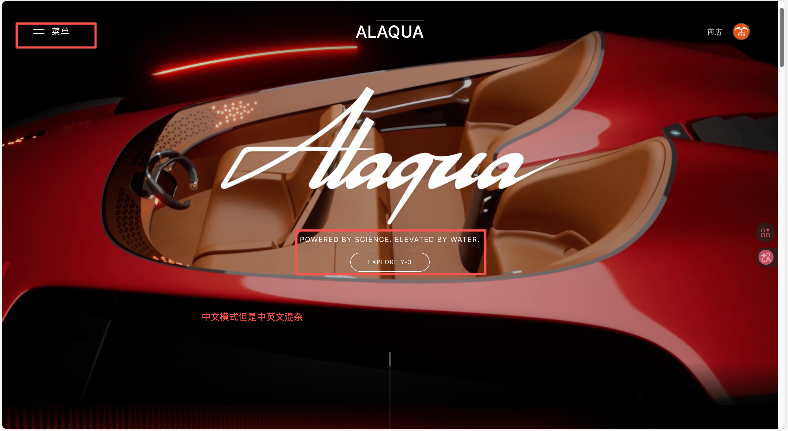

优化后，将相关文案纳入统一翻译字典，减少硬编码内容，让不同语言环境下的页面表达更完整。

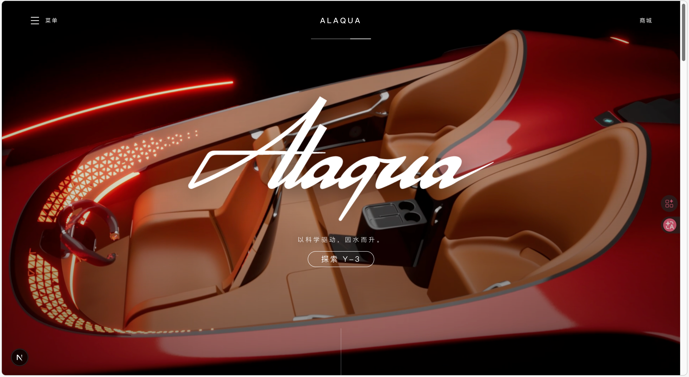

### 6.7 部分名词描述不够清晰

部分页面存在含义不够明确的名词或描述，用户第一次看到时不容易理解其具体含义。对于独立站来说，文案应该尽量减少内部术语，让用户快速理解产品价值。

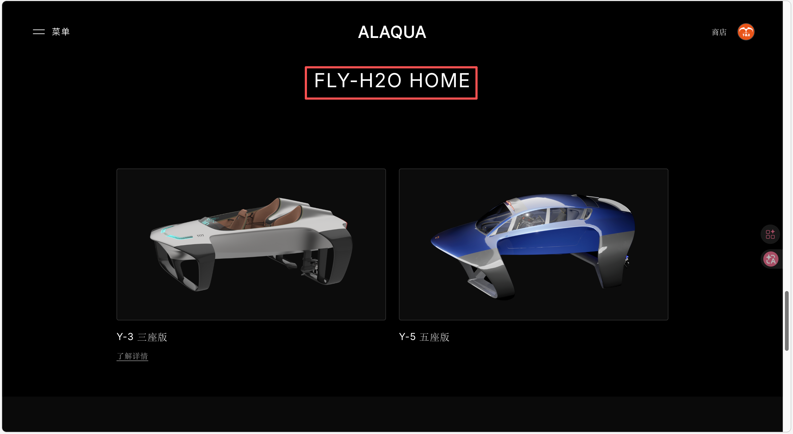

优化后，文案表达更直接，降低理解成本。

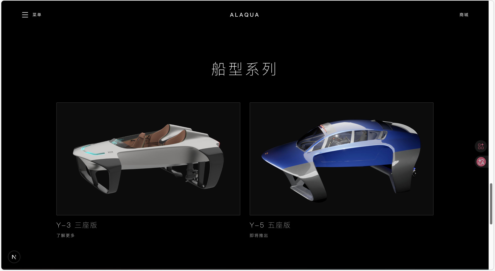

## 7. 用户分层与独立站信息架构

独立站不应该只展示“我们有什么”，更应该根据用户分层回答“你为什么需要它”。不同用户进入官网时，关注点不同，因此页面信息架构和转化路径也应该有所区分。

基于初步理解，可以先把潜在用户分为四类。这个划分还需要结合真实客户数据和业务目标继续验证，但可以作为首页信息架构优化的起点。

| 用户类型 | 典型对象 | 核心诉求 | 页面表达重点 |
| --- | --- | --- | --- |
| 文旅 / 景区 / 湖区 / 海滨项目运营商 | 景区、湖区、海滨项目、文旅集团 | 增加新项目、提升客单价、制造游客打卡点、环保运营 | 项目收益、运营安全、游客体验、案例展示 |
| 高端度假与会员制场景 | 高端海岛酒店、滨水度假村、游艇会、会员制俱乐部 | 差异化高端体验、会员权益、提升品牌调性 | 高端体验、私享服务、品牌调性、接待能力 |
| 私人高端用户 | 私人游艇用户、科技富豪、水上运动玩家 | 新奇、高端、身份感、私享体验 | 产品性能、稀缺体验、定制服务、交付保障 |
| 活动与传播场景 | 新能源大会、科技展、水上赛事、汽车品牌发布会 | 媒体传播、短期租赁、展演合作、发布会亮点 | 视频传播性、活动合作模式、安全方案、执行案例 |

后续可以考虑设计两个更清晰的入口：

- **ToB 入口**：面向景区、酒店、俱乐部、活动方，重点强调运营价值、合作模式、安全保障、项目收益和案例。
- **ToC 入口**：面向私人用户和水上运动爱好者，重点强调产品体验、性能参数、科技感、身份感和私享服务。

这样用户进入页面后可以更快找到与自己相关的信息，减少理解成本，也更容易推动咨询转化。

## 8. 深色主题使用建议

整体主题不建议默认全部使用黑色调。深色视觉确实更容易营造科技感、高级感和沉浸感，但对于信息密集页面、表单页面、产品参数页面和购买决策页面来说，深色模式不一定总是最优解。

结合已有用户体验研究和电商相关研究，可以得到一个更稳妥的结论：**深色模式适合塑造氛围，但不应牺牲可读性、信任感和转化效率**。

Pelet 与 Papadopoulou 对电商网站颜色的研究发现，网站颜色会影响用户记忆和购买意愿，色相、亮度、背景 / 前景对比都会产生作用；负面情绪虽然可能提升记忆，但可能降低购买意愿。

NN/g 对暗色模式的文献综述也比较谨慎：正常视力用户在多数情况下浅色模式视觉表现更好，尤其是在阅读、识别细节、填写表单和处理决策信息时。NN/g 不建议面对大众用户时默认强制使用暗色模式，而是建议允许用户选择。

更贴近电商的研究也有类似风险信号。2024 年一项关于移动电商暗色模式的 A/B 测试研究样本较小，只有 24 人，但结论显示，暗色模式相较浅色模式可能对用户信任和品牌感知产生负面影响。另一个关于深浅 GUI 模式的综述性研究也提到，深浅模式对信任、可读性、效率和体验的影响很复杂，并不存在一刀切答案。

因此我建议：

- **首页首屏和品牌展示区域可以保留深色科技感**，用来强化“水面飞行”的未来感和视觉冲击力。
- **产品参数、合作模式、询盘表单和长文案区域建议使用更高可读性的浅色或中性色背景**，降低阅读负担。
- **如果业务和开发成本允许，可以提供浅色 / 深色模式切换**，让用户根据环境和偏好选择。
- **最终主题色应从品牌资产出发**，而不是简单地全站黑色或全站白色。

参考资料：

- NN/g Dark Mode: `https://www.nngroup.com/articles/dark-mode/`
- NN/g Dark Mode UX Issues: `https://www.nngroup.com/articles/dark-mode-users-issues/`
- Mobile e-commerce dark mode A/B test: `https://www.diva-portal.org/smash/get/diva2%3A1874431/FULLTEXT01.pdf`
- Light / dark GUI mode review: `https://ceur-ws.org/Vol-3575/Paper15.pdf`
