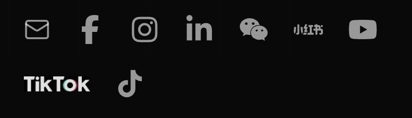
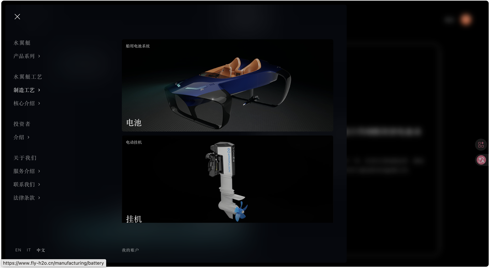

评价标准
- 代码能力
- 设计能力
- 前端认知度
- 代码规范度
- 聪明程度

1. seo的问题

我看了一下咱们现在的网站技术结构，应该是基于 Vue 做的前端单页应用。但是对于独立站来说不是最好的选择，因为他们天然SEO就会比nuxt这种框架差一些，而独立站这个品类seo很重要，可以让我们通过搜索引擎去获客。然后我看了一下robots.txt、sitemap.xml好像也没有单独配置，当然可能是因为还没有开发完。
然后我给我做的那个做了SEO，当然后面无论结果如何都会删除部署和代码资料。
为了优化SEO主要做了以下工作
- 更改了全站 canonical、sitemap、robots、sitemap
配置 robots.txt，允许搜索引擎抓核心页面，屏蔽了登录、订单、API、store/demo、help-center 等不适合收录的页面。
- 补了页面 SEO 信息，给核心页面补了 title、description、keywords、canonical、robots meta。产品页比如 /models/h1、/models/h2 是 index, follow，可以被收录。
- 避免重复/低价值页面乱收录。对非核心页面设置了 noindex, follow，避免 Google 抓到一堆重复或没价值页面，影响整体质量。
- 加了结构化数据，加了 Organization、WebSite、WebPage、Product 等 JSON-LD，帮助搜索引擎理解品牌、产品和页面类型。
- 加了 Bing IndexNow和Google Search Console 验证文件，方便搜索引擎收录

2. 因为我查的时候我有看到我们的网站，而且网站上有很多素材，所以我用了一天时间结合AI把把咱们的网站用next框架重写了一遍，然后在此基础上做了一些迭代。比如统一中英文内容， 统一 Icon，优化手机端适配与性能这些。

### 1. 增加产品定位

- 补充并强化 ALAQUA / 御水飞行的产品定位表达。
- 明确产品面向智能电动水翼船、水上交通、文旅体验和高端出行场景。
- 优化页面中的品牌叙述，使用户进入页面后能更快理解产品价值和市场方向。

### 2. 增加车型介绍

- 增加或完善车型相关介绍内容。
- 补充 Y-3、Y-5 等车型的入口和介绍信息。
- 优化车型跳转逻辑，使用户点击对应车型按钮后进入对应车型介绍页。

### 3. 统一中英文内容

- 对页面中的中文和英文文案进行统一整理。
- 保持导航、按钮、标题、表单、联系模块等位置的语言风格一致。
- 避免同一语义在不同页面或模块中出现表达不统一的问题。

### 4. 统一 Icon

- 对页面中的图标进行统一处理。
- 统一导航、社交媒体、功能入口等位置的 icon 风格。
- 保持 icon 的尺寸、颜色、粗细和视觉层级一致，提升整体品牌观感。

### 5. 调整首页车型卡片模块

- 恢复首页中段 `FLY-H2O HOME` 车型卡片展示模块。
- 保留中段增强版车型展示，继续移除官网靠底部的重复 HOME 模块。
- 中段车型卡片沿用原先存在的定制详情页链接。

### 6. 优化手机端适配与性能

- 调整手机端 footer 链接组断点，让“售后”和“产品”在可容纳的手机宽度下继续两列显示。
- 首页视频播放恢复为官方原始模式，不再额外根据可视区、滚动或页面切换主动暂停。
- 手机端性能优化后续单独处理，避免影响首页视频连续播放。

### 7. 修复车型详情页语言跟随

- 将官网语言选择同步到官方包实际读取的 `locale` 状态。
- 进入 Y-3、Y-5 详情页时，接口请求会携带当前语言，避免详情页回落为英文。
- 为 Y-3、Y-5 详情接口补充中文模板内容，保证标题、介绍、颜色、参数、图库等模块跟随中文显示。

### 8. 修复首页返回后的增强模块丢失

- 在前端路由切换、浏览器返回和菜单返回首页后，自动重新检查并恢复首页增强模块。
- 首页 DOM 被官方包重建后，会重新插入产品定位和中段 `FLY-H2O HOME` 车型模块。
- 路由返回首页后重新同步当前语言，避免首页内容回落为英文。

3.  OSS/static URL 没有限制网页访问，这样会有一些安全风险，比如我现在的素材就可以直接用你的后端，这会花你们的钱。一般来说以阿里云 OSS 为例，官方支持配置 Referer 白名单/黑名单，可以设置“只允许某些域名来源访问”，但是没有设置，可能也是正在开发阶段/其他需求所以没设置，但是已经部署在公网后出于安全建议设置。

4. 整体主题不建议全部使用黑色调
Pelet 与 Papadopoulou 对电商网站颜色的研究发现，网站颜色会影响用户记忆和购买意愿，色相、亮度、背景/前景对比都会产生作用；负面情绪虽然可能提升记忆，但会降低购买意愿。
对“暗色模式”本身，NN/g 的文献综述偏谨慎：正常视力用户在多数情况下浅色模式视觉表现更好，尤其是涉及阅读、识别细节、表单和决策信息时；NN/g 不建议面对大众用户时默认全部切成暗色，但建议允许用户选择（https://www.nngroup.com/articles/dark-mode/）。 另一篇 NN/g 文章也指出，暗色模式常被用户认为更酷、更现代、更护眼，但这种审美偏好不能弥补可用性问题（https://www.nngroup.com/articles/dark-mode-users-issues/）。
更贴近电商的研究也有风险信号。2024 年一项关于移动电商暗色模式的 A/B 测试研究（https://www.diva-portal.org/smash/get/diva2%3A1874431/FULLTEXT01.pdf），样本较小，只有 24 人，但结论是暗色模式相较浅色模式对用户信任和品牌感知有负面影响；作者也建议电商品牌在暗色模式上要谨慎，最好提供浅色/深色切换，而不是强制一种。 另一个研究(https://ceur-ws.org/Vol-3575/Paper15.pdf)关于深浅 GUI 模式的综述性研究也提到，深浅模式对信任、可读性、效率和体验的影响很复杂，没有清晰的一刀切结论；其中引用的电商信任研究显示，把原本浅色电商网站用插件自动改成暗色后，用户对图形设计和初始信任评价更低。

5. http证书不安全

接口 https://api.fly-h2o.cn/app-api/product/home-page/list 返回了明文资源
data.0.spuVideoUrl = http://oss.fly-h2o.cn/20260323/video-12_1774280438606.mp4
data.1.spuVideoUrl = http://oss.fly-h2o.cn/20260324/Y-3hongse.0000_1774335126843.mp4

后端把 spuVideoUrl 全部改成 https://（这两个地址的 https 我已验证是 200 可访问）。
前端兜底：渲染前统一把 http:// 强制替换成 https://

6. 页面操作逻辑有问题
比如以导航页为例，>一般表示可以跳转的超链接，水翼艇工艺没有超链接但是仍然可以点击跳转，会产生误导。

一般来说hover状态就是会显示不同的二级导航，但是这个是点击才显示二级导航

7. 接入了sentry，提升线上问题定位和稳定性保障
它可以自动捕获线上报错，定位具体出错位置，记录用户操作路径，监控接口异常和慢请求，区分影响范围和优先级，版本维度追踪问题，比如每次发布新版本后，可以对比新旧版本的错误数量，判断本次上线是否引入了新的线上问题。
同时当线上出现高频错误、严重异常或新版本新增问题时，可以配置告警通知，方便第一时间处理。
还可以辅助前端质量闭环，后续可以将 Sentry 作为线上质量监控入口，形成“发现问题 → 定位问题 → 修复问题 → 验证版本”的闭环。

8. 独立站的设计一定是要根据用户分层去设计的，什么样的用户应该看到什么样的独立站内容。我简单把用户分为四类
文旅景区 / 湖区 / 海滨项目运营商是第一类，他们的核心需求是增加新项目、提升客单价、制造游客打卡点、环保运营。
高端海岛酒店、滨水度假村、游艇会、会员制俱乐部是第二类，他们的需求是会员权益、差异化高端体验、提升品牌调性。
然后就是私人游艇用户、科技富豪、水上运动玩家，他们的需求可能是新奇、高端、身份感、私享体验。
最后就是新能源大会、科技展、水上赛事、汽车品牌发布会，因为“水面飞行”天然适合视频传播和媒体报道，可能会以短期租赁、展演、发布会合作切入。
他们并不需要什么技术要求，需要更多的是产品调研和素材设计。

